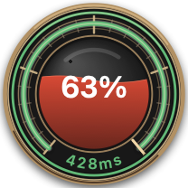
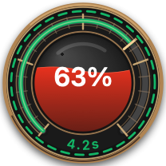
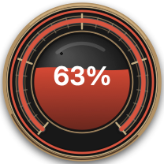
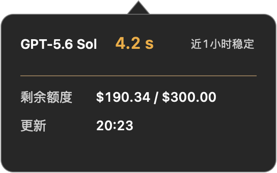

# InputStatus

一个轻量的 macOS 原生模型状态应用，不打包 Chromium、WebKit 页面或第三方运行时。支持 Intel 与 Apple Silicon Mac，并始终保持单实例。

## 功能

- 默认以 104pt 悬浮球始终置顶显示并只探测 GPT-5.6 Sol，单击原位展开详细面板后才探测全部模型；位置和详细面板尺寸会保留。
- 悬浮球中心以暗红液位显示今日剩余额度并带有轻微波纹，单一测速刻度显示 GPT-5.6 Sol API 完整响应耗时：1 秒以内为 100%，此后每秒下降 10%，10 秒及以上保持为 10%。
- 最外沿细轨显示近一小时稳定性：稳定为连续轨道，近期出现异常为断续轨道，当前请求失败为连续红色。
- 悬停悬浮球可查看 GPT-5.6 Sol 模型名称、精确 API 完整响应耗时、近一小时状态、剩余额度和更新时间。
- 悬浮球模式只探测 GPT-5.6 Sol；展开时立即补测 Terra、Lunna 和 GPT-5.5，详细模式后续刷新四个模型。
- 直接请求 `https://ai.input.im/v1/responses`，显示颜色状态点与 API 端到端完整响应耗时。
- 当前正常时显示上次异常持续时间；当前失败时显示上次正常持续时间，采用 `8m`、`1h20m` 等短格式。
- 菜单栏始终只显示 GPT-5.6 Sol API 完整响应耗时；菜单中可打开“关于”查看版本、构建号和源码地址。
- API 完整响应耗时低于 5 秒显示绿色，5 秒及以上显示黄色，只有请求失败显示红色。
- 通过 `https://ai.input.im/v1/usage` 分段显示当前 Key 今日用量、其他今日用量和今日剩余额度。
- API Key 仅保存在 macOS 钥匙串，不写入源码、设置文件或应用包；启动后仅读取一次并在本次运行内缓存。
- 默认每 1 分钟自动刷新，可在菜单中选择 1、2、5、10 或 15 分钟，也可通过面板右上角立即刷新。
- 模型探针连续失败后按 5、10、30 分钟指数退避，成功后恢复用户设置的刷新频率，手动刷新可立即重试。
- macOS 锁屏、用户会话切出、系统睡眠或合盖时停止刷新并取消进行中的探针；解锁或唤醒后等待网络恢复再继续。
- 启动时自动检查 `citrusjunoss/model-status` 的最新 GitHub Release，菜单也可手动检查；安装前校验架构、SHA-256、应用标识和代码签名。
- 从下载目录或 macOS 隔离位置首次启动时，可一键迁移到系统“应用程序”目录；系统目录不可写时自动使用个人 `~/Applications`，无需重复输入管理员密码。
- 悬浮球使用浮动窗口层级并覆盖普通应用窗口；详细面板仍使用桌面层，支持所有桌面空间和全屏辅助空间。
- 悬浮球和详细面板均可拖动；详细面板边缘可缩放，并设有防止布局挤压的最小尺寸。
- 菜单内可通过滑杆调整 20% 至 100% 的背景透明度。

## 状态球说明

<table>
  <tr>
    <th>当前正常且稳定</th>
    <th>近期发生过中断</th>
    <th>当前请求失败</th>
  </tr>
  <tr>
    <td></td>
    <td></td>
    <td></td>
  </tr>
  <tr>
    <td>绿色连续外环</td>
    <td>黄色虚线外环</td>
    <td>红色连续外环</td>
  </tr>
</table>

| 视觉元素 | 含义 |
| --- | --- |
| 中心液位和百分比 | 当前 Key 的今日剩余额度比例；液面带轻微波纹。 |
| 内侧测速弧线、指针和底部数字 | GPT-5.6 Sol API 完整响应耗时。1 秒以内指向 100%，此后每秒下降 10%，10 秒及以上保持为 10%；延时变化时会平滑移动到新位置。 |
| 绿色连续外环 | 当前请求成功，并且近一小时没有记录到中断。 |
| 黄色虚线外环 | 当前请求已恢复成功，但近一小时内发生过中断。 |
| 红色连续外环 | 当前探针请求失败。 |
| 悬停信息 | 显示模型名称、精确耗时、近一小时稳定性、剩余额度和更新时间。 |



### 延迟口径

**定义：延迟 = 完成一次真实模型 API 请求的时间。** 应用在创建探针请求前开始计时，向 `/v1/responses` 发起一次经过鉴权的非流式请求，并在 `URLSession` 收到完整响应体、进入完成回调时停止计时。界面以毫秒或秒展示该时间差。

因此该数值是 **API 端到端完整响应耗时**，可能包含 DNS 缓存未命中、TCP/TLS 建连、请求发送、网络传输、服务端排队、模型生成以及完整响应体接收时间。它不是域名 Ping、DNS 查询或单纯的网络连接延迟，也不是严格意义上的首字延迟（TTFT）。若要测量首字延迟，需要改为流式请求，并在收到第一个有效 SSE 内容事件时停止计时。

## 使用

打开应用后配置 AI INPUT API Key。2.1.2 及以后版本使用新的钥匙串项目，需要重新配置一次 Key；旧项目不会读取或删除。应用默认以悬浮球启动，单击可展开详细面板；会立即查询当日额度并按当前模式检测模型，后续无需配置网页链接或 token。

状态菜单中的“关于”使用标准 macOS 关于窗口展示当前版本号、构建号和 GitHub 源码地址。

## 构建

需要 macOS 13 或更高版本，以及 Xcode Command Line Tools。

```sh
chmod +x scripts/build-app.sh
chmod +x scripts/setup-signing.sh
chmod +x scripts/package.sh

# 首次构建前只需执行一次
./scripts/setup-signing.sh

./scripts/build-app.sh

# Intel 专用包
./scripts/build-app.sh --intel

# Apple Silicon 专用包
./scripts/build-app.sh --arm64

# 一键升级 patch 版本、构建两个架构并生成 zip
./scripts/package.sh

# 也可以升级 minor/major，或指定版本号
./scripts/package.sh --bump minor
./scripts/package.sh --version 2.3.0
```

默认命令会分别构建 `dist/InputStatus-intel.app` 和 `dist/InputStatus-arm64.app`，不再生成通用包。默认使用一次性配置的 `InputStatus Local Signing` 本地证书；为兼容已有环境，找不到新证书时会继续使用旧的 `ModelStatus Local Signing`。脚本不使用 Developer ID，也不会在每次打包时要求管理员密码；可通过 `MODEL_STATUS_SIGN_IDENTITY` 指定其他身份。GitHub Actions 使用 `MODEL_STATUS_SIGN_IDENTITY=-` 做临时 ad-hoc 签名，不保存任何私钥。跨 Mac 首次打开本地签名或 ad-hoc 包时，需要用户在 macOS 安全设置或 Finder “打开”中明确允许；正式分发仍需 Developer ID 与 Apple 公证。

GitHub 自动构建发布模板位于 `.github/workflows/release.yml`，推送 `v2.3.0` 形式的标签或手工运行工作流即可生成两个架构的 Release 包。更新器、失败指数退避以及睡眠/唤醒监听的实现说明见 `docs/IMPLEMENTATION_PLAN.md`。

应用内免登录自动更新要求 GitHub 仓库为 Public；私有仓库的 Release API 需要额外授权，应用不会内置 GitHub Token。

## 源码结构

- `Sources/ModelStatus/ApplicationMain.swift`：应用入口和单实例处理。
- `Sources/ModelStatus/AppDelegate.swift`：窗口、菜单、状态和刷新流程协调。
- `Sources/ModelStatus/Services/`：探针、额度、自动更新、自迁移和系统进程服务。
- `Sources/ModelStatus/Views/`：详细面板、状态球及悬停信息视图。
- `Sources/ModelStatus/Models.swift`：探针、额度和 GitHub Release 数据模型。
- `Sources/ModelStatus/AppConfig.swift`：应用配置、状态颜色和公共常量。
